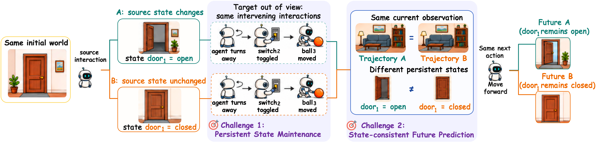
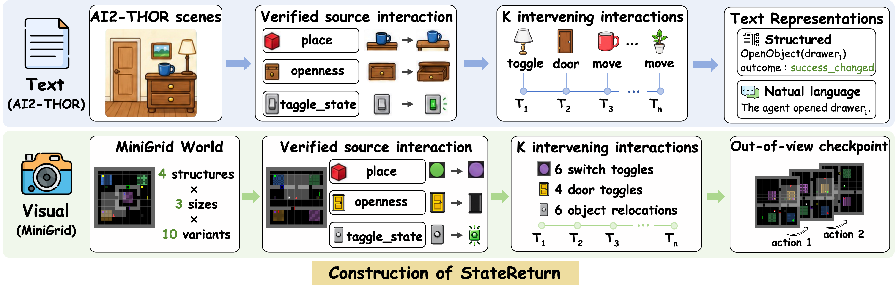

<div align="center">

# StateCommit

### Maintaining active world state for persistent world models

<p><i>What changed should survive after it leaves view.</i></p>

[](https://www.python.org/)
[](LICENSE)
[](https://statecommit.github.io/)

[🌐 Project Page](https://statecommit.github.io/) · [🤗 StateReturn Benchmark](https://huggingface.co/datasets/StateCommit/StateReturn) · [📦 Code](https://github.com/StateCommit/StateCommit_codes)

</div>

---

## The persistence gap

A current observation is not the full world state. An interaction may change a door, a switch, or an object's location; after that object leaves the camera view, two histories can yield the **same current image** while requiring different answers and different futures.

<p align="center">
  
</p>

**StateCommit** treats these interaction-established facts as explicit, inspectable state—not as an implicit trace buried in a context window or recurrent representation. It commits verified incremental updates to an Active State, then reads that state back when an object is no longer observable.

## 🔍 Overview

StateCommit is a transactional world-state maintenance framework evaluated with **StateReturn**, a benchmark for long-horizon state queries and state-consistent next-frame prediction.

The central execution path is deliberately modular:

| Stage | Responsibility | Public reference component |
|---|---|---|
| **Ground** | Extract a typed candidate state transition from public event evidence. | `methods/visual/e0_5/` |
| **Compile** | Express that fact as one restricted `set_state(...)` patch. | `methods/visual/e1/fast_path_agents.py` |
| **Audit** | Check that the patch preserves the grounded fact and satisfies Runtime preflight checks. | `GroundedPatchAuditor` |
| **Commit** | Atomically apply accepted updates to a versioned Active State. | `ActiveStateRuntime` |
| **Read / render** | Answer a state query or supply causal state to a next-frame renderer. | `methods/visual/e1/`, `methods/visual/e2_next_frame/` |

The separation is intentional: a malformed, stale, or evidence-inconsistent patch is rejected **before** it can alter Active State. A rejected patch leaves the state unchanged.

```text
public interaction evidence
          │
          ▼
Grounder fact → restricted Programmer → grounded Patch Auditor → versioned Runtime
                                                                  │
                                                                  ▼
                                                   state query / causal renderer input
```

### What this release contains

This repository is the reference implementation of the **public-input protocol**, StateCommit Runtime, and method-side inference components.

| Included | Intentionally not included |
|---|---|
| Text and Visual public-data validators | Training pipeline and model weights |
| Transactional StateCommit Runtime and Visual Fast Path | Official evaluator, hidden test labels, masks, and counterfactual targets |
| Text StateCommit (`wcm`) plus history-based baselines | Experiment outputs and paper prediction artifacts |
| Public causal next-frame job builder and prediction-format validator | Simulator metadata, plans, or reveal frames |

This boundary makes the method interface auditable: released code never opens an evaluator label or an oracle state value.

---

## 🧭 StateReturn at a glance

StateReturn asks a simple question with a deliberately difficult answer: **after many unrelated interactions, can a model still recover what one earlier event changed?**

<p align="center">
  
</p>

| Track | Environment | Public method input | Main query |
|---|---|---|---|
| **Text** | AI2-THOR event streams | Structured event API *or* natural-language event history | What is the current state of the queried entity? |
| **Visual** | Partially observed MiniGrid worlds | RGB frames, raw actions, entity catalog, and query | State query or causal next-frame prediction |

The release uses the intervening-history checkpoints `K ∈ {0, 1, 2, 4, 8, 16}`. StateReturn contains **1,200 text episodes / 7,050 text queries** and a Visual suite with **120 world layouts**, **360 streams**, and **2,160 checkpoints per visual task**.

### Reported long-horizon result

Full-State Exact Match (FSEM ↑) requires the complete tracked state to be correct—not merely the queried slot.

| Task at `K=16` | StateCommit |
|---|---:|
| Text · structured representation | **100.00 FSEM** |
| Text · natural-language representation | **98.67 FSEM** |
| Visual full-state maintenance | **100.00 FSEM** |

See the [project page](https://statecommit.github.io/#results) for the complete comparison, visual examples, and prediction metrics.

---

## 🔧 Installation

The protocol validators have no third-party runtime dependencies. Python **3.10+** is required.

```bash
git clone https://github.com/StateCommit/StateCommit_codes.git
cd StateCommit_codes

python -m venv .venv
source .venv/bin/activate              # Windows: .venv\Scripts\activate
python -m pip install --upgrade pip
python -m pip install -e .

statereturn-public --help
```

Install optional learned-method dependencies only when you run a local Qwen-based method or visual Grounder:

```bash
python -m pip install -r requirements-optional.txt
```

## ✅ Validate the public benchmark inputs

Download the corresponding release from the [StateReturn dataset repository](https://huggingface.co/datasets/StateCommit/StateReturn), then run the validators before executing a method:

```bash
# StateReturn Text v1.0
statereturn-public verify-text \
  --dataset-root /path/to/StateReturn-Text-v1.0

# StateReturn Visual v1.0 development release
statereturn-public verify-visual \
  --dataset-root /path/to/StateReturn-Visual-v1.0-development
```

Both commands validate the released public protocol and return a stable release fingerprint. They never open labels.

---

## 🚀 Run the released reference paths

### 1. Text: StateCommit and history baselines

`scripts/run_text_method.py` is resumable and runs one method over a single public representation. The StateCommit text method is `wcm`.

```bash
python scripts/run_text_method.py \
  --dataset-root /path/to/StateReturn-Text-v1.0 \
  --output-root /path/to/runs/text_wcm_structured \
  --split validation \
  --representation structured \
  --method wcm \
  --model-path /path/to/local/Qwen2.5-Coder-7B-Instruct \
  --device cuda:0
```

Run the same public protocol with the released context and memory baselines by changing `--method`:

| Method key | Memory policy |
|---|---|
| `wcm` | StateCommit: explicit world-code memory |
| `full_history` | Complete event history in context |
| `budgeted_full_history` | Bounded recent event window (`--history-budget-events`) |
| `rolling_summary` | Running text summary (`--summary-chars`) |
| `irmem` | Learned implicit recurrent memory (`--irmem-checkpoint`) |

Use `--representation natural` to run the aligned natural-language track. A Natural run opens only Natural records; it never reads the Structured representation to recover an action or state value.

### 2. Visual: transactional StateCommit Fast Path

The canonical Visual state-query path consumes public Grounder facts and executes the same guarded chain used by the reference method:

```text
Grounder fact → deterministic restricted Programmer → Grounded Patch Auditor → versioned Runtime
```

```bash
statereturn-public run-visual-statecommit \
  --dataset-root /path/to/StateReturn-Visual-v1.0-development \
  --split validation \
  --facts /path/to/grounder_facts.jsonl \
  --output-root /path/to/runs/visual_statecommit
```

Each JSONL row in `--facts` contains exactly `stream_id`, `frame_index`, and `raw_output`. The run writes causal state predictions, full tracked-state dumps when applicable, Runtime traces, and a public run report under `--output-root`.

### 3. Visual: causal next-frame jobs

The public package prepares causal renderer inputs without exposing a factual future, a counterfactual future, source masks, or a state answer.

```bash
# Create one public job per next-frame query.
statereturn-public build-next-frame-jobs \
  --dataset-root /path/to/StateReturn-Visual-v1.0-development \
  --split validation \
  --output /path/to/next_frame_jobs.jsonl

# After your renderer writes {query_id, task, png_path} records, validate coverage and paths.
statereturn-public validate-next-frame-predictions \
  --jobs /path/to/next_frame_jobs.jsonl \
  --predictions /path/to/predictions.jsonl \
  --output-root /path/to/renderer_outputs
```

The validator checks format, coverage, and safe PNG paths only. Scoring remains in the separately held evaluator.

---

## 🧩 Protocol guarantees

The code is designed so a method can be audited by what it is allowed to see.

- **Causal prefixes only.** A query is answered at its `prefix_end_frame` before later public frames are processed.
- **No evaluator bypass.** Public method code does not import test labels, oracle state, masks, plans, action success, simulator metadata, or reveal RGB.
- **Typed state updates.** The Runtime checks entity/component validity, version, expected previous value, and invariants before commit.
- **Atomic state.** A rejected patch cannot partially mutate Active State.
- **Representation isolation.** Textual Structured and Natural representations are never cross-read.

<details>
<summary><b>Why is the Visual Fast Path split into agents?</b></summary>

The visual Grounder performs perception and emits a typed candidate fact. The Programmer can only compile that fact into one restricted `set_state(...)` call. The Auditor verifies that the compiled patch preserves the grounded evidence and passes the Runtime preflight. This prevents a later component from silently changing the entity, component, or proposed value inferred from the public frames.

</details>

---

## 📁 Repository guide

```text
StateCommit_codes/
├── src/statereturn_public/       # Public CLI, text/visual validation, next-frame I/O contracts
├── methods/
│   ├── text/
│   │   ├── e1core/               # Frozen Text public transition protocol
│   │   └── baseline/             # StateCommit (wcm) and released memory baselines
│   └── visual/
│       ├── e0/                   # Public Visual benchmark reader
│       ├── e0_5/                 # Grounder protocol and learned-Qwen adapter
│       ├── e1/                   # Runtime, Fast Path agents, state-query runner
│       ├── e2_memory/            # Visual memory interfaces
│       └── e2_next_frame/        # State-conditioned renderer interfaces
├── scripts/
│   ├── run_text_method.py        # Resumable public Text runner
│   └── train_text_irmem.py       # IRMem training utility
├── assets/readme/                # README figures
├── requirements-optional.txt     # Learned-method extras
└── LICENSE                       # MIT License
```

## 📖 Citation

If you use StateCommit or StateReturn, please cite:

```bibtex
@inproceedings{anonymous2027statecommit,
  title     = {StateCommit: Maintaining Active World State for Persistent World Models},
  author    = {Anonymous Authors},
  booktitle = {International Conference on Learning Representations},
  year      = {2027}
}
```

Citation metadata will be updated after the anonymous review process.

## ⚖️ License

This repository is released under the [MIT License](LICENSE).
